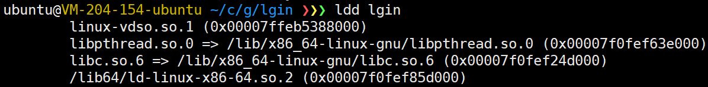
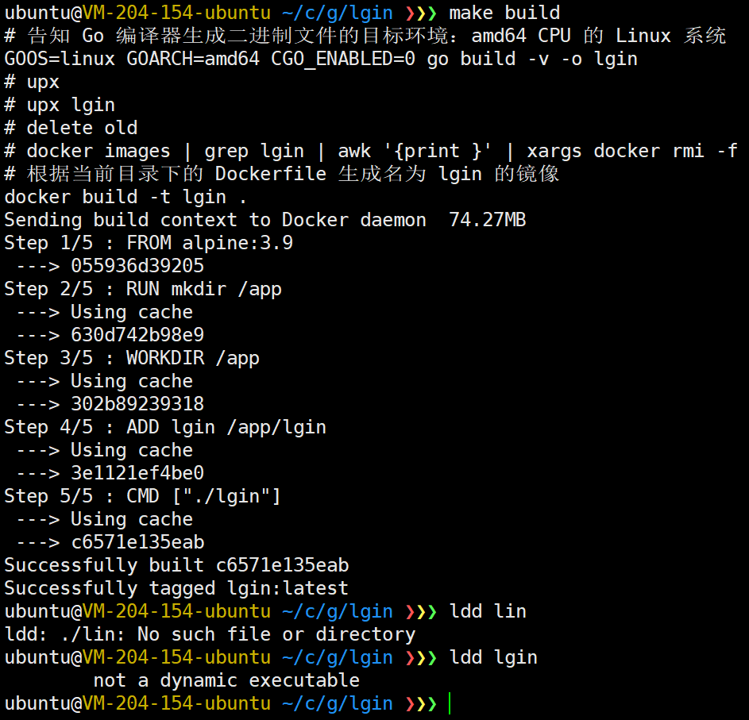
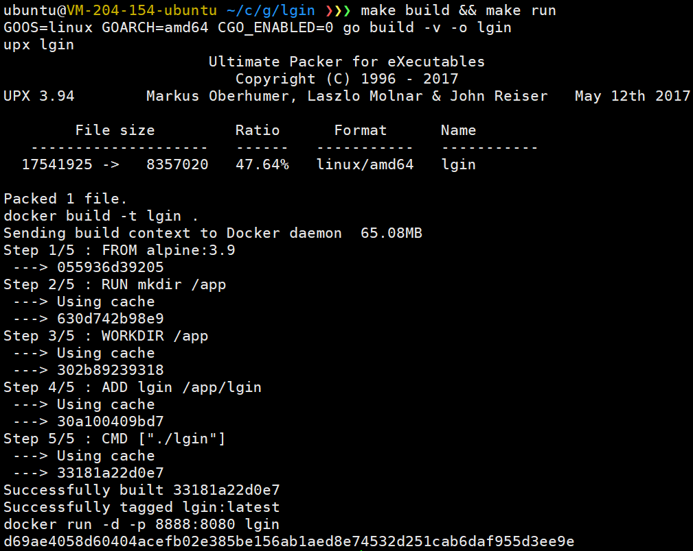
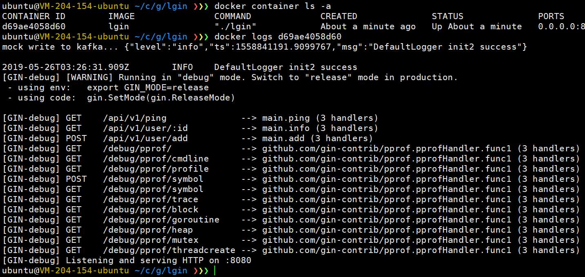

# 最简的Makefile

## Makefile
```makefile
build:
	# 告知 Go 编译器生成二进制文件的目标环境：amd64 CPU 的 Linux 系统
	GOOS=linux GOARCH=amd64 CGO_ENABLED=0 go build -v -o lgin
	# upx
	upx lgin
	# 根据当前目录下的 Dockerfile 生成名为 lgin 的镜像
	docker build -t lgin .
run:
	# 在 Docker alpine 容器的 50001 端口上运行 lgin 服务
	# 可添加 -d 参数将服务放到后台运行
	docker run -d -p 8888:8080 lgin
```

**注意**
`CGO_ENABLED=0`是避免出现 `standard_init_linux.go:207: exec user process caused "no such file or directory"`这个错误
- `CGO_ENABLED=1`时，编译的二进制会依赖`libc`库

- alpine里面并没有libc库，就会出现上面这个错误
- 加了`CGO_ENABLED=0`之后，编译的二进制


## Dockerfile

```dockerfile
# 使用最新版 alpine 作为基础镜像
FROM alpine:latest
# 在容器的根目录下创建 app 目录
RUN mkdir /app
# 将工作目录切换到 /app 下
WORKDIR /app
# 将二进制文件拷贝到 /app 下
ADD lgin /app/lgin
# 运行服务端
CMD ["./lgin"]
```

## 结果

