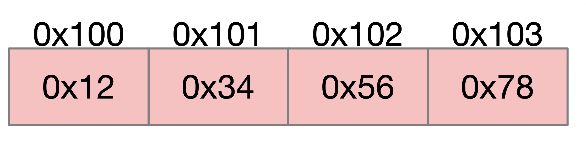
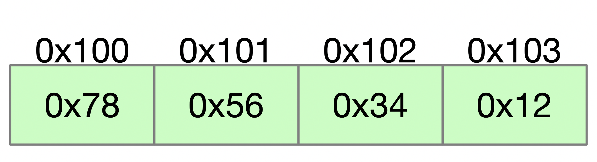

# 字节序 

## 大小端

### 什么是大小端?

计算机底层硬件有两种存储数据的方式。大端字节序（big endian）和小端字节序（little endian）。

0x2211使用两个字节存储，高位是 `0x22` 低位是 `0x11`

### 大端

全称是大端字节序 `big endian`。 高位在前，低位在后。这是符合人类的读写习惯的方法。

比如 0x12345678,使用大端存储,内存地址与存储的关系如下。

### 小端

全程是小端字节序 `little endian`。低位在前，高位在后。

0x12345678 使用小端存储。内存与存储的关系如下。

### 为什么需要大小端？

首先，计算机电路先处理低位字节，因为计算都是从低位开始的。所一般以计算机内部处理都是小端字节序（不同cpu架构不同）。

但是，人类的阅读和记录习惯是从高位开始，即所谓的大端字节序。

## 网络序、主机序

网络上传输的都是字节流，在传输的时候先传输那个字节?

### 网络序

网络字节序是tcp/ip中规定的一种数据传输方式，与具体的操作系统和cpu类型无关。tcp/ip协议规定网络字节序采用大端字节序的方式传输

### 主机序

即主机的存储方式，与cpu架构相关。

