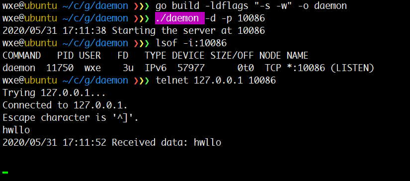
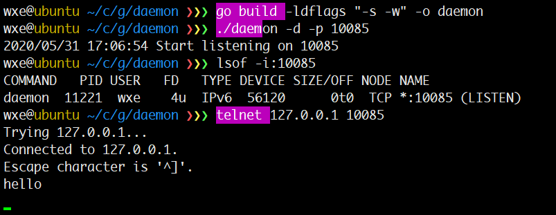

# 代码层实现daemon

## 方法一 cgo

**不支持windows**

Cgo 调用daemon函数

```go
package main

/*
#include <unistd.h>
*/
import "C"
import (
	"flag"
	"log"
	"net"
	"strconv"
)

var (
	daemon bool
	port   int
)

func main() {
	flag.BoolVar(&daemon, "d", false, "-d")
	flag.IntVar(&port, "p", 12345, "-p")
	flag.Parse()
	if daemon {
		C.daemon(1, 1)
	}
	log.Printf("Starting the server at %d\n", port)
	listener, err := net.Listen("tcp", ":"+strconv.Itoa(port))
	if err != nil {
		log.Fatalf("Error listening:%v", err)
		return
	}
	for {
		if conn, err := listener.Accept(); err == nil {
			go handle(conn)
		} else {
			log.Fatalf("error accepting:%v", err)
		}
	}
}

func handle(conn net.Conn) {
	for {
		buf := make([]byte, 512)
		if _, err := conn.Read(buf); err == nil {
			log.Printf("Received data: %v\n", string(buf))
		} else {
			log.Printf("Error reading %v", err)
		}
	}
}
```



函数原型是 
```c
#include <unistd.h>
/**
    @param __nochdir 是否改变工作目录 0 将工作目录设置为根目录 "/"
    @param __noclose 是否重定向输出 0 将标准输入/输出/错误重定向到 /dev/null 
    @return 0 成功 -1 失败 
*/
int daemon (int __nochdir, int __noclose);
```

## 方法二 外部库

使用第三方库 [github.com/sevlyar/go-daemon](https://github.com/sevlyar/go-daemon)

**不支持windows**

```go
import (
	"flag"
	"log"
	"net"
	"strconv"

	"github.com/sevlyar/go-daemon"
)

var (
	onDaemon bool
	port     int
)

func runDaemon() (cntxt *daemon.Context) {
	cntxt = &daemon.Context{
		PidFilePerm: 0644,
		LogFilePerm: 0640,
		WorkDir:     "./",
		Umask:       022,
	}

	child, err := cntxt.Reborn()
	if err != nil {
		log.Fatal("Unale to run: ", err)
	}
	if child != nil {
		return nil
	}
	return cntxt
}

func main() {
	flag.BoolVar(&onDaemon, "d", false, "-d")
	flag.IntVar(&port, "p", 12345, "-p")
	flag.Parse()
	if onDaemon {
		cntxt := runDaemon()
		if cntxt == nil {
			log.Printf("Start listening on %d\n", port)
			return
		}
		defer cntxt.Release()
		log.Print("daemon started")
		serve()
	}
}

func serve() {
	listener, err := net.Listen("tcp", ":"+strconv.Itoa(port))
	if err != nil {
		log.Fatalf("Error listening:%v", err)
		return
	}
	for {
		if conn, err := listener.Accept(); err == nil {
			go handle(conn)
		} else {
			log.Fatalf("error accepting:%v", err)
		}
	}
}

func handle(conn net.Conn) {
	for {
		buf := make([]byte, 512)
		if _, err := conn.Read(buf); err == nil {
			log.Printf("Received data: %v\n", string(buf))
		} else {
			log.Printf("Error reading %v", err)
		}
	}
}
```

