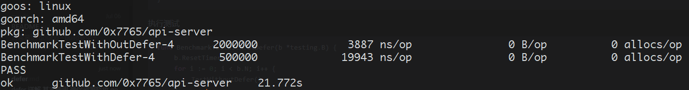

# defer 详解

## 基本使用

### 确保资源释放

```go
var lock sync.Mutex

func defer0() {
	lock.Lock()
	defer lock.Unlock()
}
```

### catch 下游panic

```go
func defer1() {
	defer func() {
		if err := recover(); err != nil {
			log.Println(err)
		}
	}()
	panic("panic")
}
```

### 计算耗时

```go
func defer2() {
	defer func(start time.Time) {
		log.Println("cost", time.Since(start))
	}(time.Now())

	time.Sleep(time.Second)
}
```

### 延迟调用

```go
func defer3() {
	for i := 0; i < 5; i++ {
		defer fmt.Println(i)
	}
}
// 输出 4，3，2，1，0 类似栈
```

## defer 和return

- 示例一

```go
// return的步骤
// 1. 给返回值赋值  res=-100
// 2. 调用defer表达式 res=-100+1
// 3. 返回给调用函数 res=-99
func deferWithReturn1() (res int){
	defer func() {
		res++
	}()
	return -100
}
```

- 示例二

```GO
// defer func 发生了值拷贝
// res++ 改变的值和实际返回值的res 不是同一个
// 返回-100
func deferWithReturn2() (res int){
	defer func(res int) {
		res++
	}(res)
	return -100
}
// 输出-100
```

- 示例三

```GO
// 这里传递的是地址
// 所以返回的时-99
func deferWithReturn3() (res int){
	defer func(res *int) {
		*res++
	}(&res)
	return -100
}
```

## 性能测试

```go
func TestWithoutDefer() (sum int, cost time.Duration) {
	start := time.Now()
	for i := 0; i < 10000; i++ {
		sum += i
	}
	cost = time.Since(start)
	return
}

func TestWithDefer() (sum int, cost time.Duration) {
	defer func(start time.Time) {
		cost = time.Since(start)
	}(time.Now())
	for i := 0; i < 10000; i++ {
		sum += i
	}
	return
}

// benchmark
func BenchmarkTestWithOutDefer(b *testing.B) {
	b.ResetTimer()
	for i := 0; i < b.N; i++ {
		TestWithoutDefer()
	}
}

func BenchmarkTestWithDefer(b *testing.B) {
	b.ResetTimer()
	for i := 0; i < b.N; i++ {
		TestWithDefer()
	}
}
```

执行测试

```GO
func BenchmarkTestWithOutDefer(b *testing.B) {
	b.ResetTimer()
	for i := 0; i < b.N; i++ {
		TestWithoutDefer()
	}
}

func BenchmarkTestWithDefer(b *testing.B) {
	b.ResetTimer()
	for i := 0; i < b.N; i++ {
		TestWithDefer()
	}
}
// go test -bench=. -benchtime=5s -benchmem -run=none
```



## 原理

```GO
func main() {
	defer fmt.Println("hello")
}
// 编译
// go build -o test main.go
//  go tool objdump -s "main\.main" test
```

输出的结果

```assembly
TEXT main.main(SB) main.go
  main.go:10            0x4873c0                64488b0c25f8ffffff      MOVQ FS:0xfffffff8, CX
  main.go:10            0x4873c9                483b6110                CMPQ 0x10(CX), SP
  main.go:10            0x4873cd                0f8686000000            JBE 0x487459
  main.go:10            0x4873d3                4883ec58                SUBQ $0x58, SP
  main.go:10            0x4873d7                48896c2450              MOVQ BP, 0x50(SP)
  main.go:10            0x4873dc                488d6c2450              LEAQ 0x50(SP), BP
  main.go:11            0x4873e1                0f57c0                  XORPS X0, X0
  main.go:11            0x4873e4                0f11442440              MOVUPS X0, 0x40(SP)
  main.go:11            0x4873e9                488d05b0100100          LEAQ 0x110b0(IP), AX
  main.go:11            0x4873f0                4889442440              MOVQ AX, 0x40(SP)
  main.go:11            0x4873f5                488d0524870400          LEAQ main.statictmp_0(SB), AX
  main.go:11            0x4873fc                4889442448              MOVQ AX, 0x48(SP)
  main.go:11            0x487401                c7042430000000          MOVL $0x30, 0(SP)
  main.go:11            0x487408                488d05118d0300          LEAQ 0x38d11(IP), AX
  main.go:11            0x48740f                4889442408              MOVQ AX, 0x8(SP)
  main.go:11            0x487414                488d442440              LEAQ 0x40(SP), AX
  main.go:11            0x487419                4889442410              MOVQ AX, 0x10(SP)
  main.go:11            0x48741e                48c744241801000000      MOVQ $0x1, 0x18(SP)
  main.go:11            0x487427                48c744242001000000      MOVQ $0x1, 0x20(SP)
  main.go:11            0x487430                e8cbf7f9ff              CALL runtime.deferproc(SB) // 这是核心 
  main.go:11            0x487435                85c0                    TESTL AX, AX
  main.go:11            0x487437                7510                    JNE 0x487449
  main.go:12            0x487439                90                      NOPL
  main.go:12            0x48743a                e85100faff              CALL runtime.deferreturn(SB)
  main.go:12            0x48743f                488b6c2450              MOVQ 0x50(SP), BP
  main.go:12            0x487444                4883c458                ADDQ $0x58, SP
  main.go:12            0x487448                c3                      RET
  main.go:11            0x487449                90                      NOPL
  main.go:11            0x48744a                e84100faff              CALL runtime.deferreturn(SB)
  main.go:11            0x48744f                488b6c2450              MOVQ 0x50(SP), BP
  main.go:11            0x487454                4883c458                ADDQ $0x58, SP
  main.go:11            0x487458                c3                      RET
  main.go:10            0x487459                e8a27efcff              CALL runtime.morestack_noctxt(SB)
  main.go:10            0x48745e                e95dffffff              JMP main.main(SB)
```

1. defer被编译成两个函数调用 `deferproc` 和 `deferreturn`。使用`deferproc`执行defer的逻辑，在返回之间插入`deferreturn`指令。
2. 每次defer调用都会创建一个defer对象(实际是带缓存)，将这个defer放在当前线程的defer链表头
3. `deferreturn` 会从链表中取出defer结构并依次执行。

## 结构

- _defer 结构

```go
// src/runtime/runtime2.go:729
type _defer struct {
	siz     int32   // 目标函数的参数长度
	started bool    
    sp      uintptr // sp at time of defer 调用deferproc时的 SP(栈指针)
    pc      uintptr // 调用deferproc时的 PC(程序计数器)
	fn      *funcval // funcval 代表参数不确定的函数 在这里指向defer调用的函数
	_panic  *_panic // panic that is running defer
	link    *_defer
}
```

- newdefer

```go
//go:nosplit
func newdefer(siz int32) *_defer {
	var d *_defer
    // 参数长度对齐 获取缓存等级
	sc := deferclass(uintptr(siz))
	gp := getg()
    // 未超出缓存大小
	if sc < uintptr(len(p{}.deferpool)) {
		pp := gp.m.p.ptr()
        // 当前p的本地缓存队列已空 从全局提取一批到本地
		if len(pp.deferpool[sc]) == 0 && sched.deferpool[sc] != nil {
			// Take the slow path on the system stack so
			// we don't grow newdefer's stack.
			systemstack(func() {
				lock(&sched.deferlock)
				for len(pp.deferpool[sc]) < cap(pp.deferpool[sc])/2 && sched.deferpool[sc] != nil {
					d := sched.deferpool[sc]
					sched.deferpool[sc] = d.link
					d.link = nil
					pp.deferpool[sc] = append(pp.deferpool[sc], d)
				}
				unlock(&sched.deferlock)
			})
		}
        // 从本地队列缓存尾部提取
		if n := len(pp.deferpool[sc]); n > 0 {
			d = pp.deferpool[sc][n-1]
			pp.deferpool[sc][n-1] = nil
			pp.deferpool[sc] = pp.deferpool[sc][:n-1]
		}
	}
    // 新建
	if d == nil {
		// Allocate new defer+args.
		systemstack(func() {
			total := roundupsize(totaldefersize(uintptr(siz)))
			d = (*_defer)(mallocgc(total, deferType, true))
		})
		if debugCachedWork {
			// Duplicate the tail below so if there's a
			// crash in checkPut we can tell if d was just
			// allocated or came from the pool.
			d.siz = siz
			d.link = gp._defer
			gp._defer = d
			return d
		}
	}
    // 放到 G._defer 链表
	d.siz = siz
	d.link = gp._defer
	gp._defer = d
	return d
}
```

- deferproc 函数调用

```go
// src/runtime/panic.go:92
// Create a new deferred function fn with siz bytes of arguments.
// The compiler turns a defer statement into a call to this.
//go:nosplit
func deferproc(siz int32, fn *funcval) { // arguments of fn follow fn
	if getg().m.curg != getg() {
		// go code on the system stack can't defer
		throw("defer on system stack")
	}

	// the arguments of fn are in a perilous state. The stack map
	// for deferproc does not describe them. So we can't let garbage
	// collection or stack copying trigger until we've copied them out
	// to somewhere safe. The memmove below does that.
	// Until the copy completes, we can only call nosplit routines.
	sp := getcallersp()
	argp := uintptr(unsafe.Pointer(&fn)) + unsafe.Sizeof(fn)
	callerpc := getcallerpc()

    // 初始化或者创建一个_defer 结构体
	d := newdefer(siz)
	if d._panic != nil {
		throw("deferproc: d.panic != nil after newdefer")
	}
    // 设置它的fn pc sp 参数
	d.fn = fn
	d.pc = callerpc
	d.sp = sp
    // 将 defer 相关的函数都拷贝到紧挨着结构体的内存空间中
	switch siz {
	case 0:
		// Do nothing.
	case sys.PtrSize:
		*(*uintptr)(deferArgs(d)) = *(*uintptr)(unsafe.Pointer(argp))
	default:
		memmove(deferArgs(d), unsafe.Pointer(argp), uintptr(siz))
	}

	// deferproc returns 0 normally.
	// a deferred func that stops a panic
	// makes the deferproc return 1.
	// the code the compiler generates always
	// checks the return value and jumps to the
	// end of the function if deferproc returns != 0.
	return0()
	// No code can go here - the C return register has
	// been set and must not be clobbered.
}
```

- return0()

```go
// in asm_*.s
// 汇编实现的 执行deferreturn函数调用
func return0()
```

- deferreturn

```go
// src/runtime/panic.go:345
//go:nosplit
func deferreturn(arg0 uintptr) {
	gp := getg()
    // 提取 defer 延迟对象
	d := gp._defer
	if d == nil {
		return
	}
	sp := getcallersp()
	if d.sp != sp {
		return
	}

	// Moving arguments around.
	//
	// Everything called after this point must be recursively
	// nosplit because the garbage collector won't know the form
	// of the arguments until the jmpdefer can flip the PC over to
	// fn.
	switch d.siz {
	case 0:
		// Do nothing.
	case sys.PtrSize:
		*(*uintptr)(unsafe.Pointer(&arg0)) = *(*uintptr)(deferArgs(d))
	default:
        // 将延迟对象的参数 复制到堆栈上
		memmove(unsafe.Pointer(&arg0), deferArgs(d), uintptr(d.siz))
	}
	fn := d.fn
	d.fn = nil
	gp._defer = d.link
    // freedefer 将_defer 放回P.deferpool 缓存，当数量超出时，会转移部分到sched.deferpool
	freedefer(d)
    // 执行延迟函数
	jmpdefer(fn, uintptr(unsafe.Pointer(&arg0)))
}
```


