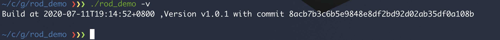

# ldflags

> `-ldflags` 用于给 go链接器传入参数。

## 支持的功能

```bash
# 通过help 选项查看支持的参数列表 
go tool link --help
```

## 常见的用法

### -W 去掉调试信息

```shell
-w	disable DWARF generation
```

DWARF 是一种可以包含在二进制文件中的调试数据格式。

通常可以减少编译后的二进制的体积。去掉编译二进制中的 zdebug信息

```go
package main

import (
	"fmt"
)

func main() {
	fmt.Println("Hello World ")
}

// 编译 
// go build -o hello 
// 查看符号表 
// objdump hello -h
```

可以对比编译前后的信息  `-w` 选项的二进制中少了`zdebug`的部分

## -s 去掉符号表

```
-s	disable symbol table
```

符号表中一般包含了局部变量、全局变量和函数名等的信息。

## -X 定义变量

```
-X definition
    	add string value definition of the form importpath.name=value
```

一般用于 定义包的版本

1. version.go

    ```go
    import (
    	"fmt"
    )
    
    var (
    	version   = ""
    	buildTime = ""
    	tag       = ""
    )
    
    func Version() string {
    	return fmt.Sprintf("Build at %s ,Version %s with commit %s \\n", buildTime, tag, version)
    }
    ```

2. main.go 

    ```go
    import (
    	"flag"
    	"fmt"
    )
    
    var (
    	v bool
    )
    
    func main() {
    	flag.BoolVar(&v, "v", false, "show version info")
    	flag.Parse()
    	if v {
    		fmt.Println(Version())
    	}
    }
    ```

3. build.sh

    ```shell
    #!/usr/bin/env bash
    
    BUILD=$(date +%FT%T%z)
    TAG=$(git describe)
    COMMIT_SHA1=$(git rev-parse HEAD)
    go build -ldflags="-X main.buildTime=${BUILD} -X main.tag=${TAG} -X main.version=${COMMIT_SHA1}"
    ```

4.  测试

    

