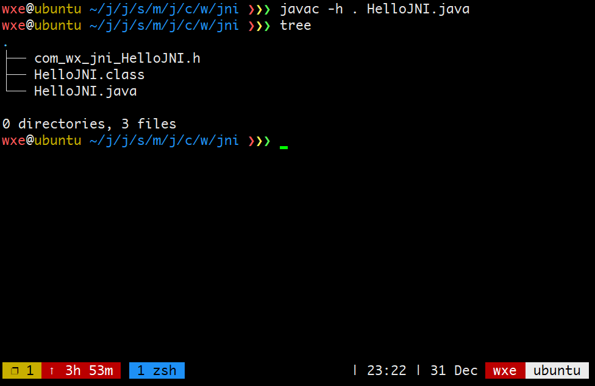
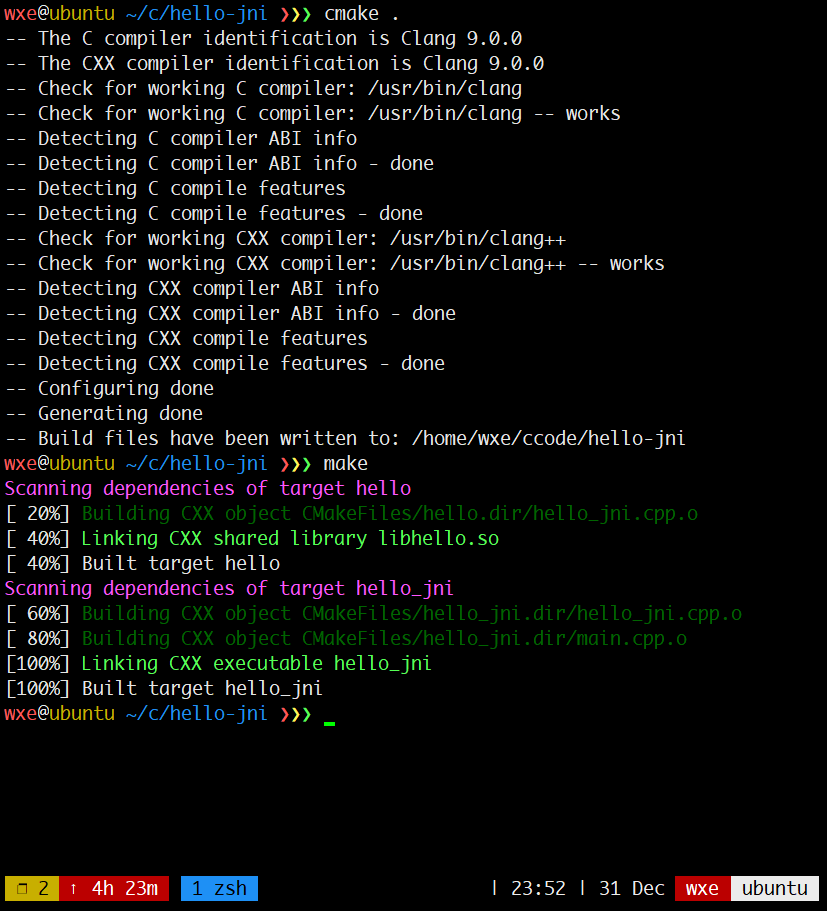
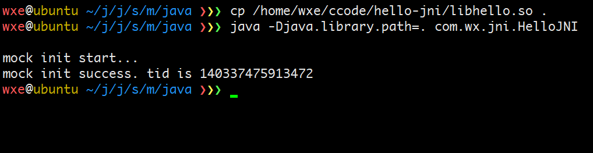
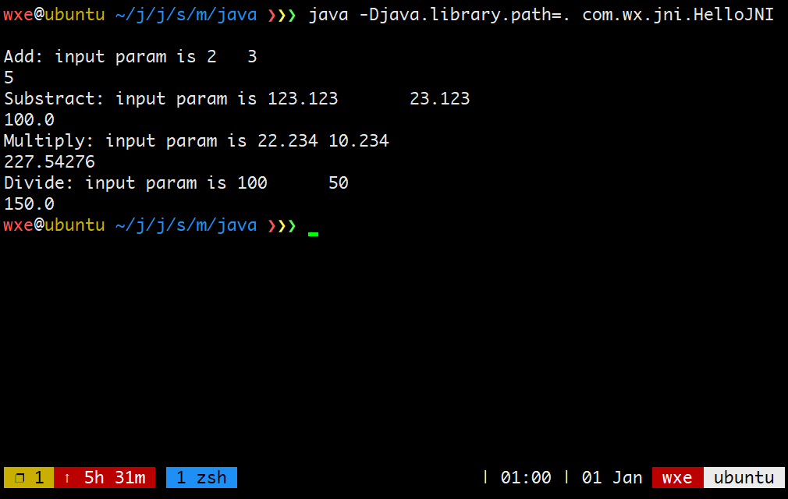

# `jni` 

全称：`Java Native Interface`。提供了一系列`api`,使得`java`与`c/c++` 语言可以通信。

# 示例

## 无返回值

### `java`代码

```java
package com.wx.jni;

public class HelloJNI {
	// 加载动态库  这个动态库包含一个 Init的method
	// windows: hello.dll
	// linux: hello.so
	// mac: hello.dylib
	static {
		System.loadLibrary("hello");
	}
	
	public native void Init(String name);
	
	public static void main(String[] args) {
		new HelloJNI().Init("Mr Lu");
	}
}
```

### 生成 `header` 文件

```shell
javac -h . HelloJNI.java
```



### `header` 说明

```c++
/* DO NOT EDIT THIS FILE - it is machine generated */
#include <jni.h>
/* Header for class com_wx_jni_HelloJNI */

#ifndef _Included_com_wx_jni_HelloJNI
#define _Included_com_wx_jni_HelloJNI
#ifdef __cplusplus
extern "C" {
#endif
/*
 * Class:     com_wx_jni_HelloJNI
 * Method:    Greeting
 * Signature: (Ljava/lang/String;)Ljava/lang/String;
 */
JNIEXPORT jstring JNICALL Java_com_wx_jni_HelloJNI_Greeting
  (JNIEnv *, jobject, jstring);

#ifdef __cplusplus
}
#endif
#endif
```

1.  `java` 函数到 `JNI`的映射规则是`Java_{package_name}_{class_name}_{method_name}(arguments)`
2.  `JNIEnv` 只想`JNI`环境，包含大量的api
3.  `jobject` `this`指针, 指向 `this`的`java` 对象

### 实现

使用`clion`创建`cmake project`

-   `CMakeFiles.txt`

```cmake
cmake_minimum_required(VERSION 3.15)
project(hello_jni)

set(CMAKE_CXX_STANDARD 14)

# g++选项中的-I参数的作用
include_directories($ENV{JAVA_HOME}/include $ENV{JAVA_HOME}/include/linux)

# windows平台换成下面这个
# include_directories($ENV{JAVA_HOME}\\include $ENV{JAVA_HOME}\\include\\win32)

# 生成动态库
add_library(hello SHARED hello_jni.cpp)

add_executable(hello_jni
        com_wx_jni_HelloJNI.h
        hello_jni.cpp
        main.cpp)
```

-   `hello_jni.cpp`

```c++
//
// Created by adamw on 2019/12/31.
//
#include "com_wx_jni_HelloJNI.h"
#include <jni.h>
#include <iostream>
#include<thread>

JNIEXPORT void JNICALL Java_com_wx_jni_HelloJNI_Init(JNIEnv *env, jobject obj, jstring) {
	std::cout << "mock init start..." << std::endl;
	const std::thread::id tid = std::this_thread::get_id();
	std::cout << "mock init success. tid is " << tid << std::endl;
}
```

### 编译

```cmake
cmake .
make 
```



### 运行`java`

复制动态库到`java`项目位置

```shell
java -Djava.library.path=. com.wx.jni.HelloJNI
```



## 数字型返回值

### `Java` 代码

```java
package com.wx.jni;

public class HelloJNI {
	static {
		System.loadLibrary("calculate");
	}
	
	public native int Add(int a, int b);
	
	public native double Subtract(double a, double b);
	
	public native float Multiply(float a, float b);
	
	public native double Divide(double a, double b);
	
	public static void main(String[] args) {
		HelloJNI helloJNI = new HelloJNI();
		System.out.println(helloJNI.Add(2, 3));
		System.out.println(helloJNI.Subtract(123.123d, 23.123d));
		System.out.println(helloJNI.Multiply(22.234f, 10.234f));
		System.out.println(helloJNI.Divide(100.0d, 50.0d));
	}
}
```

### 生成`C header`

```shell
javac -h . HelloJNI.java
```

```C++
/* DO NOT EDIT THIS FILE - it is machine generated */
#include <jni.h>
/* Header for class com_wx_jni_HelloJNI */

#ifndef _Included_com_wx_jni_HelloJNI
#define _Included_com_wx_jni_HelloJNI
#ifdef __cplusplus
extern "C" {
#endif
/*
 * Class:     com_wx_jni_HelloJNI
 * Method:    Add
 * Signature: (II)I
 */
JNIEXPORT jint JNICALL Java_com_wx_jni_HelloJNI_Add
  (JNIEnv *, jobject, jint, jint);

/*
 * Class:     com_wx_jni_HelloJNI
 * Method:    Subtract
 * Signature: (DD)D
 */
JNIEXPORT jdouble JNICALL Java_com_wx_jni_HelloJNI_Subtract
  (JNIEnv *, jobject, jdouble, jdouble);

/*
 * Class:     com_wx_jni_HelloJNI
 * Method:    Multiply
 * Signature: (FF)F
 */
JNIEXPORT jfloat JNICALL Java_com_wx_jni_HelloJNI_Multiply
  (JNIEnv *, jobject, jfloat, jfloat);

/*
 * Class:     com_wx_jni_HelloJNI
 * Method:    Divide
 * Signature: (DD)D
 */
JNIEXPORT jdouble JNICALL Java_com_wx_jni_HelloJNI_Divide
  (JNIEnv *, jobject, jdouble, jdouble);

#ifdef __cplusplus
}
#endif
#endif
```

### 实现

`calculate.cpp`

```C++
//
// Created by adamw on 2019/12/31.
//
#include "com_wx_jni_HelloJNI.h"
#include <jni.h>
#include <iostream>

JNIEXPORT jint JNICALL Java_com_wx_jni_HelloJNI_Add(JNIEnv *env, jobject obj, jint a, jint b) {
	std::cout << "Add: input param is " << a << "\t" << b << std::endl;
	return a + b;
}


JNIEXPORT jdouble JNICALL Java_com_wx_jni_HelloJNI_Subtract(JNIEnv *env, jobject obj, jdouble a, jdouble b) {
	std::cout << "Substract: input param is " << a << "\t" << b << std::endl;
	return a - b;
}

JNIEXPORT jdouble JNICALL Java_com_wx_jni_HelloJNI_Divide(JNIEnv *env, jobject obj, jdouble a, jdouble b) {
	std::cout << "Divide: input param is " << a << "\t" << b << std::endl;
	return a + b;
}

JNIEXPORT jfloat JNICALL Java_com_wx_jni_HelloJNI_Multiply(JNIEnv *env, jobject obj, jfloat a, jfloat b) {
	std::cout << "Multiply: input param is " << a << "\t" << b << std::endl;
	return a * b;
}
```

### 编译&&执行

```shell
cmake . && make
# 进入java 项目
cp /home/wxe/ccode/hello-jni/libcalculate.so .
javac com/wx/jni/HelloJNI.java
java -Djava.library.path=. com.wx.jni.HelloJNI 
```



## `string` 型返回值

和之前相同的步骤，`java` 文件和`header` 文件分别如下. `cmakelists` 中修改动态库的名称为`add_library(str SHARED calculate.cpp)`

```java
package com.wx.jni;

public class HelloJNI {
	static {
		System.loadLibrary("calculate");
	}
	public native String Greeting(String name);
	
	public static void main(String[] args) {
		System.out.println(new HelloJNI().Greeting("Mr lu"));
	}
}
```

```C++
/* DO NOT EDIT THIS FILE - it is machine generated */
#include <jni.h>
/* Header for class com_wx_jni_HelloJNI */

#ifndef _Included_com_wx_jni_HelloJNI
#define _Included_com_wx_jni_HelloJNI
#ifdef __cplusplus
extern "C" {
#endif
/*
 * Class:     com_wx_jni_HelloJNI
 * Method:    Greeting
 * Signature: (Ljava/lang/String;)Ljava/lang/String;
 */
JNIEXPORT jstring JNICALL Java_com_wx_jni_HelloJNI_Greeting
  (JNIEnv *, jobject, jstring);

#ifdef __cplusplus
}
#endif
#endif
```

### 实现

```C++
//
// Created by adamw on 2019/12/31.
//
#include "com_wx_jni_HelloJNI.h"
#include <jni.h>
#include <iostream>
#include <string>
#include<ctime>

JNIEXPORT jstring JNICALL Java_com_wx_jni_HelloJNI_Greeting(JNIEnv *env, jobject obj, jstring in) {

	// 1. 转换成utf8
	const char *in_str = env->GetStringUTFChars(in, NULL);
	if (in_str == NULL) {
		return NULL;
	}
	std::cout << "in param is " << in_str << std::endl;
	// 2. 通知 JVM 这块内存已经不使用
	// 3. getStringxxx 与 releaseStringxxx是成对出现的
	env->ReleaseStringUTFChars(in, in_str);

	time_t t = time(NULL);
	char ch[64] = {0};
	strftime(ch, sizeof(ch) - 1, "%Y-%m-%d %H:%M:%S", localtime(&t));
	return env->NewStringUTF(ch);
}
```

### 编译执行

```shell
cmake . && make
cp /home/wxe/ccode/hello-jni/libstr.so .
java -Djava.library.path=. com.wx.jni.HelloJNI
# 输出
in param is Mr lu
2020-01-01 13:36:05
```

