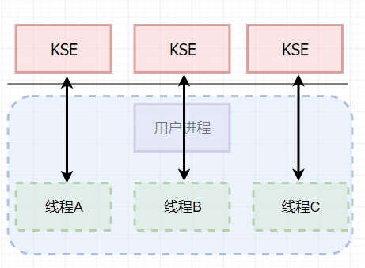
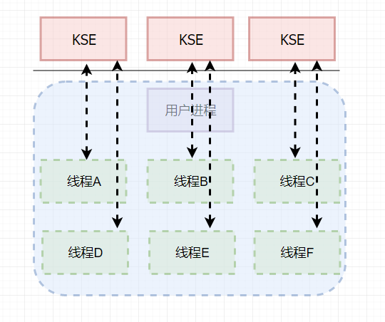

# 线程实现模型

## 名词术语

1. KSE `kernel scheduling entity` 内核调度实体。即是可以被**内核调度器调度的对象**

## 主要有三种

- [ ] 用户级线程模型
- [ ] 内核级线程模型
- [ ] 两级线程模型

## 用户级线程模型

**又称多对一线程模型(m:1)**

这种模式，线程是有用户级别的线程库全权管理的，线程库也不是内核的一部分，存储在进程的用户空间中，这些线程对内核来说是透明的，调度和协调与内核无关。

- 优点

  - 线程的创建、终止、切换、同步、调度无需让cpu从用户态切换到内核态，相对高效
  - 可移植性强，因为线程的生命周期和调度无内核平台无关

- 缺点

  - 无法真正利用多核的优势
  - 很局限，线程的优先级受限于进程的优先级

  

## 内核级线程模型

**又称一对一线程模型**

该模式下，`一个进程可以与多个KSE关联`。线程的调度由内核负责管理，线程也是内核的一部分。`进程中的每一个线程都是和内核的线程调度实体一一对应的`。(Java就是这种模式)。即使一个线程等待io调度或者被阻塞，不影响其他线程的调度

- 优点
  - 可有效利用多核资源
  - 可以实现真正意义上的并行、并发
  - 使用操作系统的调度实现线程调度
- 缺点
  - 线程的创建和调度需要用到内核的资源
  - 调度相对比较慢

## 两级线程模型

**又称多对多线程模型(M:N)**

这种模式下，`一个进程可以与多个KSE关联`，和内核级线程不同的是，进程中的线程并不与KSE一一对应，这些线程可以映射到同一个已关联的KSE上。首先，线程库会通过操作系统创建多个内核级线程，然后，使用这些内核级线程对应用程序线程进行调度。go采用的是这个模型

- 优点
  - 在充分利用多核资源的同时，线程的管理和调度更加灵活高效
- 缺点
  - 线程库实现很复杂，需要内核和线程库协作一起调度线程

说明: **实际上线程ABCDEF可能对应的是任何一个KSE**

